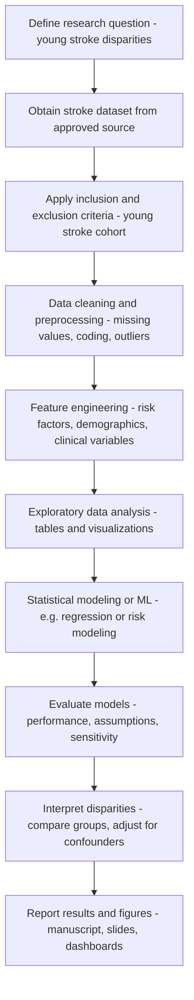

## Young Stroke Disparity

This repository contains code and analysis for studying **disparities in young stroke** outcomes. It appears to focus on exploratory data analysis and statistical modeling in a Jupyter notebook (`disparity_young-claen.ipynb`), with the goal of understanding how stroke characteristics and outcomes differ across populations.

> If this description is not perfectly aligned with your project’s goals, feel free to tell me and I can refine the wording or add more technical detail.

---

### Study Workflow (Flowchart)

Below is a high-level overview of how the study is conducted, from data to results.



---

### Project Structure

- **`disparity_young-claen.ipynb`**: Main analysis notebook for data cleaning, exploration, modeling, and visualization related to young stroke disparities.
- **`.gitignore`**: Git ignore rules to keep temporary, large, or sensitive files out of version control.

You may also have additional data or results files locally (for example, CSVs, parquet files, or figures) that are not committed to git.

---

### Getting Started

- **Prerequisites**
  - Python 3.9+ (any recent version should work)
  - `pip` or `conda` for managing packages
  - Jupyter (Notebook or Lab)

- **Clone the repository**

```bash
git clone <YOUR_REPO_URL>.git
cd Young-Stroke-Disparity
```

- **Create and activate a virtual environment (recommended)**

```bash
python -m venv .venv
source .venv/bin/activate   # on macOS/Linux
# .venv\Scripts\activate    # on Windows (PowerShell/CMD)
```

- **Install dependencies**

If you already maintain a `requirements.txt` or `environment.yml`, install from that file, for example:

```bash
pip install -r requirements.txt
```

If not, a typical stack for this type of analysis is:

```bash
pip install jupyter pandas numpy matplotlib seaborn scikit-learn statsmodels
```

---

### Running the Analysis

1. **Start Jupyter**

   ```bash
   jupyter notebook
   ```

2. In the browser, open **`disparity_young-claen.ipynb`**.
3. Run the cells from top to bottom, adjusting any configuration paths (for example, where your raw data files live) as needed.

---

### Data

Because stroke and health data often involve sensitive personal information:

- **Raw data is typically not committed** to this repository.
- You may need to obtain the dataset from its original, approved source (for example, a clinical registry, hospital system, or public health database) and store it locally in a secure location.

If there is a specific expected folder structure for data (for example, `data/raw`, `data/processed`), you can document it here. Example:

- `data/raw/` – Original datasets (not version-controlled)
- `data/processed/` – Cleaned and transformed data used in the notebook
- `outputs/` – Figures, tables, and model outputs

---

### Reproducibility Notes

- **Environment**: Use a dedicated virtual environment and pin versions in `requirements.txt` (or use `pip freeze > requirements.txt`) once your setup is stable.
- **Randomness**: If the analysis uses random splits or simulations, set a random seed to make results reproducible.
- **Data paths**: Consider using configuration variables at the top of the notebook for all file paths, so they are easy to update.

---

### Contributing

If you or collaborators plan to extend this work:

- Use feature branches and pull requests.
- Keep notebooks clean:
  - Clear unnecessary intermediate outputs.
  - Use clear, descriptive markdown cells to explain each step.
- Consider refactoring repeated logic into reusable Python modules (for example, `src/` or `utils/`) as the project grows.

---

### License

Specify a license for this work if you plan to share or publish it (for example, MIT, Apache 2.0, or an institutional/research-specific license). For now, this section is a placeholder.

